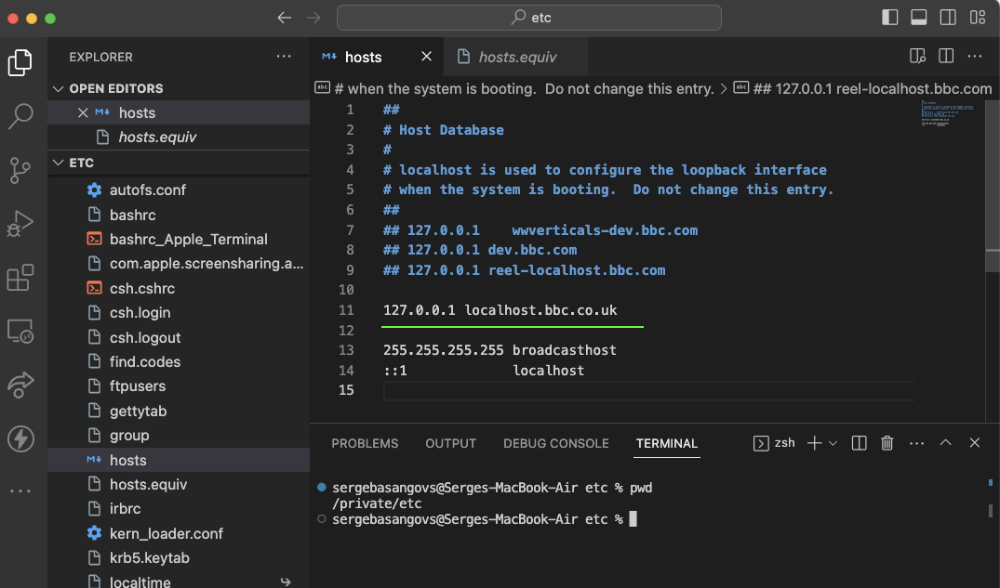

## Hi, the Smp setup on macOS locally

- clone this repo, run `yarn` run install packages.
- go to `/etc/hosts` and set value `127.0.0.1 localhost.bbc.co.uk`,(see `Appendix/Images` ) all the rest comment out using `##`, ( don't use `CMD + ?` keys as it may use different comment synthax )
- flush ur machine dns cache: `sudo killall -HUP mDNSResponder`
- run `yarn dev`
- open ur browser at `http://localhost.bbc.co.uk:8081`

## Appendix

- Images
  
